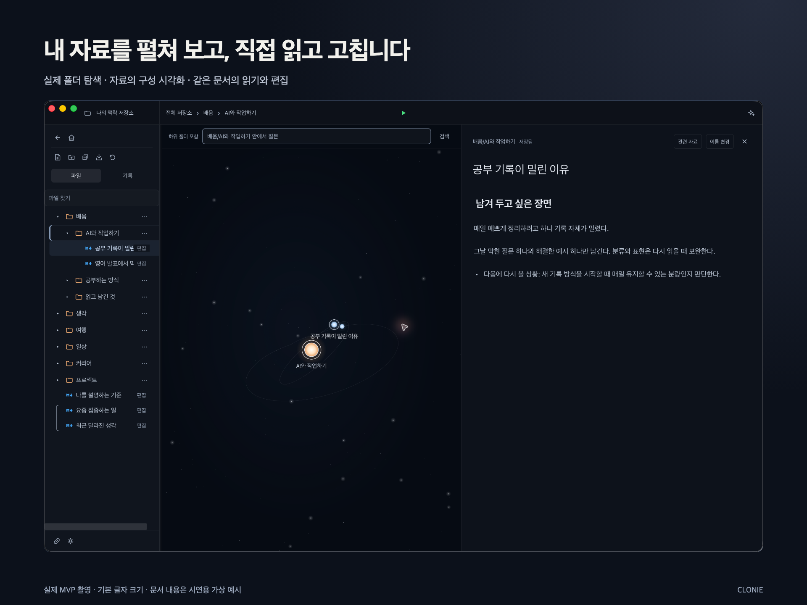
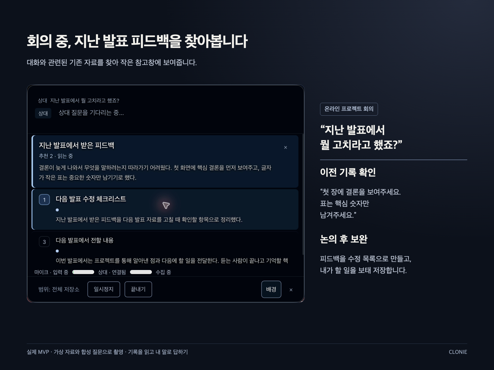
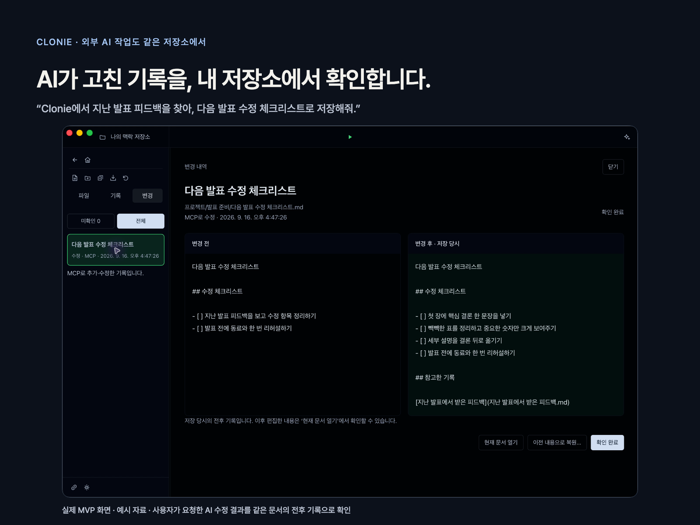

# Clonie

**나만의 맥락 저장소.**

흩어진 생각과 자료를 내 저장소에 쌓고, 필요한 순간 나와 AI가 함께 꺼내 씁니다.
Clonie는 내 Markdown 폴더를 연결해 자료를 찾고, 읽고, 고치는 macOS 앱입니다.

**[Mac용 다운로드 · 1.0.6](https://github.com/qoal1201/clonie-preview/releases/download/preview-20260919-clonie1/Clonie-1.0.6-arm64-notarized.zip)** · [설치 안내](INSTALL.md) · [변경 기록](CHANGELOG.md) · [피드백](https://github.com/qoal1201/clonie-preview/issues/new?template=feedback.yml)

macOS 26 이상 · Apple Silicon(M 시리즈). 기본 검색·편집에는 AI 계정이나 API 키가 필요하지 않습니다.
Developer ID 서명과 Apple 공증을 적용한 알파입니다. macOS 첫 실행 확인과 폴더·음성 권한은 별도이며, [설치 안내](INSTALL.md#첫-실행)를 따라 주세요.

*실제 앱 화면에 설명을 더한 예시입니다. 문서 내용은 시연용 가상 자료입니다.*

## 내 자료를 연결하고, 쓰면서 가꾸기

| 하고 싶은 일 | Clonie에서 |
| --- | --- |
| 쌓아 둔 자료 다시 찾기 | Markdown 폴더를 연결하고 질문으로 관련 문서와 근거 문단을 찾습니다. 제목과 본문을 읽고 같은 자리에서 편집합니다. |
| PDF·Word도 함께 보관하기 | 원본을 보존하면서 읽을 수 있는 문서로 가져옵니다. 변환 도구는 처음 사용할 때 준비합니다. |
| 대화 중 이전 기록 참고하기 | 사용 모드의 작은 참고창에서 음성 질문과 관련된 자료를 확인합니다. 사용을 마치면 기록 탭에서 대화와 찾았던 자료를 돌아봅니다. |
| 외부 AI와 같은 자료 활용하기 | MCP를 지원하는 AI 도구를 선택해 연결합니다. AI가 문서를 저장·수정하면 변경 탭에서 전후를 확인합니다. |

음성 사용과 외부 AI 연결은 선택 사항입니다. 검색·편집만으로 시작해도 됩니다.
앱 검색과 음성 질문은 같은 저장소의 자료를 찾습니다. 사용 모드는 관련 자료를 보여주며 새 답변을 생성하지 않습니다.

대화 중 자료를 참고하는 화면

실제 앱에 가상 자료와 합성 질문을 넣어 촬영한 예시입니다. 실제 사람의 음성 인식 정확도를 측정한 결과는 아닙니다.
사용 시작에서 자료 범위와 입력을 고릅니다. 마이크만 쓰면 내 질문으로, 상대 음성을 포함하면 상대 질문으로 검색합니다.
사용을 마치면 ‘끝내기’를 누릅니다. 창을 숨기는 것만으로 음성 수집이 끝나지는 않습니다.

외부 AI가 바꾼 문서를 확인하는 화면

요청한 AI 작업의 저장 결과를 같은 저장소에서 확인합니다. ‘확인 완료’는 이미 저장된 변경을 읽었다는 표시입니다.
이후 다른 수정과 충돌하지 않을 때 이전 내용으로 복원할 수 있습니다.

## 처음 사용하기

1. 위 **Mac용 다운로드**에서 ZIP을 받고, 압축을 풀어 `Clonie.app`을 응용 프로그램 폴더로 옮깁니다.
2. 앱을 열어 ZIP에 함께 든 `sample-vault` 또는 시험용 Markdown 폴더를 연결합니다.
3. 기억해 두고 싶은 내용을 질문으로 찾아 문서를 엽니다. 내용을 조금 고친 뒤 다시 검색해 보세요.

앱의 편집은 연결한 실제 파일에 저장됩니다. 처음에는 중요한 자료의 복사본으로 시작하세요.
GitHub의 `Code → Download ZIP`은 설치 앱이 아닌 소스 코드입니다.

[Homebrew](INSTALL.md#homebrew로-설치) · [터미널 설치](INSTALL.md#homebrew-없이-설치) · [AI 에이전트에게 설치 맡기기](INSTALL.md#ai-에이전트에게-맡기기) · [기존 설치 업데이트](INSTALL.md#기존-설치-업데이트)

## 내 자료와 개인정보

- Markdown과 검색 색인·대화 기록은 연결한 폴더에 저장됩니다. 기본 검색과 현재 음성 처리는 기기 안에서 수행합니다.
- 음성을 사용할 때 필요한 권한을 요청합니다. 화면을 여는 것만으로 수집을 시작하지 않습니다.
- 외부 AI를 연결하고 자료를 참고하도록 요청하면, 그 도구가 읽은 내용은 해당 AI 서비스에 전달될 수 있습니다.
- PDF·Word 변환 도구와 모델을 처음 준비할 때는 인터넷 연결이 필요합니다.

저장 위치·외부 연결·삭제에 관한 자세한 내용은 [개인정보와 데이터 안내](PRIVACY.md)를 확인하세요.

## 현재 알아둘 점

- **알파 버전:** 검색이 관련 없는 자료를 추천하거나 음성을 잘못 인식할 수 있습니다. 관련도는 정답 보장이 아닙니다.
- **지원 환경:** macOS 26 이상 Apple Silicon용입니다. Intel Mac·Windows는 지원하지 않으며 macOS 27은 아직 검증하지 않았습니다.
- **사용 모드:** 배경 불투명도는 35–100%로 조절하며 기본은 100%입니다. 저장소 화면과 macOS의 ‘투명도 줄이기’ 설정에서는 불투명하게 표시됩니다.
- **화면 공유:** 캡처 제외 설정이 기본 적용되지만 회의 도구·OS마다 결과가 다를 수 있습니다. 공유 전에 실제 미리보기를 확인하세요. 배경 투명도와 화면 공유 비노출은 다른 기능입니다.

여러 저장소 통합·기기 간 동기화·공유는 현재 제공하지 않습니다.

## 피드백과 참여

[사용 피드백](https://github.com/qoal1201/clonie-preview/issues/new?template=feedback.yml)에 **하려던 일·기대한 결과·실제 결과**를 알려주세요.
검색이라면 어떤 자료를 기대했는지, 그 결과가 실제 작업에 도움이 됐는지도 궁금합니다.
개인 문서 원문이나 API 키는 공개하지 않아도 됩니다. 보안 문제는 [비공개 제보](SECURITY.md)를 이용하세요.

이 저장소는 Clonie의 공개 소스·배포·피드백 창구입니다. 작은 수정과 문서 개선을 환영합니다.
코드 기여와 직접 빌드는 [기여 안내](CONTRIBUTING.md), 버전별 개선은 [변경 기록](CHANGELOG.md)에서 확인할 수 있습니다.

## 라이선스와 출처

신규 자체 변경에는 [PolyForm Perimeter 1.0.1](LICENSE)을 적용합니다.
개인·회사 내부 업무 사용은 허용하며, 해당 코드를 이용한 경쟁 제품 제공은 제한합니다.
사용 제한이 있는 **소스 공개**로 OSI 오픈소스 라이선스는 아닙니다.
기존 MIT 권리와 제3자 고지는 유지합니다. [적용 범위](LICENSING.md) · [제3자 고지](ThirdPartyNotices/) · [프로젝트 출처](HISTORY.md)
