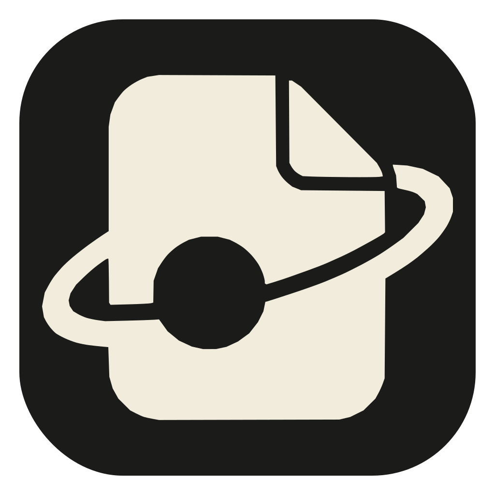
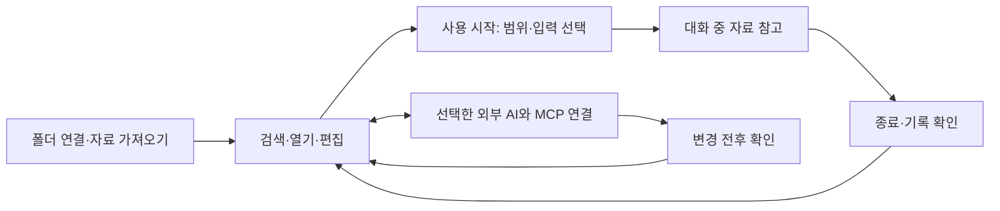

# Clonie



**나만의 맥락 저장소로 가꿉니다.**

흩어진 생각과 자료를 내 저장소에 쌓고, 필요한 순간 나와 AI가 함께 꺼내 씁니다.
Clonie는 사용자 소유의 Markdown 폴더를 연결해 자료를 찾고, 읽고, 고치는 macOS 앱입니다.
기록을 쌓는 데서 그치지 않고, 대화와 작업에서 얻은 생각을 다시 보태며 가꾸는 경험을 만들고 있습니다.

[공개 알파 설치](#빠른-설치) · [사용 피드백](https://github.com/qoal1201/clonie-preview/issues)

## 이번 공개판 · Clonie 1.0.5

최신 공개 알파는 **Clonie 1.0.5 · `preview-20260917-clonie1`**입니다.
[변경 내용과 검증 범위](RELEASE-NOTES.md)를 함께 확인해 주세요.

- Markdown 폴더 연결·탐색·검색과 서식을 보며 같은 자리에서 편집·자동 저장
- 원본을 보존하는 PDF·Word 가져오기
- 음성 질문으로 같은 저장소 검색, 사용 종료 후 대화 기록 확인과 문서 보완
- 외부 AI의 MCP 연결, 요청한 세션 기록, 문서 변경 전후 확인

여러 저장소를 한곳에서 다루기, 기기 간 동기화와 공유·연결은 후속 구상입니다.
현재 제공 기능이나 출시 일정으로 약속하지 않습니다.

## 빠른 설치

지원 환경은 **macOS 26 이상, Apple Silicon Mac**입니다. 설치 뒤 앱이 자동으로 실행되지는 않습니다.

Homebrew를 사용한다면 다음 명령을 실행합니다.

```bash
brew tap qoal1201/clonie-preview https://github.com/qoal1201/clonie-preview
brew install --cask qoal1201/clonie-preview/clonie
```

Homebrew가 없다면 공개 저장소의 최신 설치 스크립트를 내려받아 실행할 수 있습니다.

```bash
curl -fL https://raw.githubusercontent.com/qoal1201/clonie-preview/main/scripts/install.sh -o /tmp/clonie-install.sh
bash /tmp/clonie-install.sh
```

이 설치기는 동봉 모델이 포함된 릴리스 앱의 SHA-256을 확인하고, 기본적으로
`~/Applications/Clonie.app`에 설치합니다. 같은 위치에 기존 `Clonie.app`이 있으면 중단하며, 기존 앱을 덮어쓰거나 종료·삭제하지 않습니다.
설치가 끝난 뒤 앱을 자동으로 열지 않습니다.

AI 에이전트에게 설치를 맡기려면 저장소 주소와 함께 다음처럼 요청하면 됩니다.

> https://github.com/qoal1201/clonie-preview 의 README와 AGENTS.md를 읽고,
> 내 Mac의 지원 여부와 기존 설치를 확인한 뒤 Clonie를 설치하고 실행해 줘.
> 처음 쓸 수 있도록 폴더 연결까지 안내하고, 내가 직접 승인해야 하는 단계는 알려 줘.

에이전트용 절차는 [AGENTS.md](AGENTS.md), 설치 위치·첫 실행·문제 해결은
[INSTALL.md](INSTALL.md)에 있습니다.

설치 스크립트나 Homebrew를 쓰지 않으려면 [preview-20260917-clonie1 릴리스](https://github.com/qoal1201/clonie-preview/releases/tag/preview-20260917-clonie1)에서
Apple Silicon용 ZIP을 내려받아 압축을 풀고 `Clonie.app`을 응용 프로그램 폴더로 옮기면 됩니다.

첫 실행 때 macOS가 앱을 막으면 시스템 설정의 개인정보 보호 및 보안에서 해당 앱을 확인한 뒤
**확인 없이 열기(Open Anyway)**를 직접 승인해야 합니다. 음성을 처음 사용할 때는 선택한 입력에 필요한
마이크·시스템 오디오 권한과 Apple 음성 모델을 준비합니다. 이미 허용한 권한은 다시 요구하지 않습니다.

## 화면과 전체 사용 흐름

| 화면 | 하는 일 |
| --- | --- |
| 저장소 | 폴더와 문서를 탐색하고, 자료에 질문하고, 문서를 읽고 고칩니다. PDF·Word도 가져올 수 있습니다. |
| 미리 사용 | 참고창의 배치와 질문·마이크 입력을 시험합니다. 실제 대화 전에 조작을 익히는 용도입니다. |
| 사용 모드 | 다른 작업 위에 작은 참고창을 띄워 음성 질문에 관련된 내 자료를 보여줍니다. 새 답변을 생성하는 기능은 아닙니다. |
| 기록 탭 | 사용을 끝낸 뒤 대화 원문·찾았던 자료를 확인하고, 필요한 내용을 문서에 보완합니다. |
| 변경 탭 | MCP로 저장된 문서의 변경 전후를 확인합니다. 확인 완료는 저장 승인이 아니며, 충돌이 없을 때 이전 본문을 복원할 수 있습니다. |



외부 AI 연결과 음성 사용은 선택 사항입니다. 저장소 검색·편집만으로도 사용할 수 있습니다.
창을 숨기거나 자료를 열어도 시작한 음성 수집은 계속됩니다. 멈추려면 일시정지 또는 끝내기를 누르세요.

### 사용 모드의 투명화

- **배경 투명도:** 사용 모드·미리 사용의 참고창은 설정에서 불투명도를 35–100%로 조절할 수 있습니다. 기본은 100%이며 저장소 작업 화면은 불투명합니다. macOS의 ‘투명도 줄이기’가 켜져 있으면 가독성을 위해 불투명하게 표시합니다.
- **화면 공유·캡처 비노출:** 일반 실행에는 창을 캡처에서 제외하도록 하는 설정이 기본 적용됩니다. 그러나 회의 도구·캡처 방식·macOS에 따라 결과가 다를 수 있으므로 실제 공유 미리보기에서 확인해야 합니다. 모든 녹화·화면 공유에서 보이지 않는다는 보장은 아닙니다.

현재 캡처 제외 구현에 쓰는 값은 [Apple 문서](https://developer.apple.com/documentation/appkit/nswindow/sharingtype-swift.enum)에서 레거시로 설명합니다. 배경을 반투명하게 만드는 것 자체가 화면 공유에서 창을 숨겨 주는 것은 아닙니다.

## 사용법

1. `Clonie.app`을 열고 Markdown 폴더를 연결합니다. 처음에는 `sample-vault`나 복사해 둔 시험용 폴더를 권합니다.
2. 파일 탐색에서 문서를 열고 편집한 뒤 저장 표시를 확인합니다.
3. 같은 자료를 질문으로 검색하고, 답이 없는 질문도 넣어 검색 경계를 확인합니다.
4. 필요하면 파일 이름 변경·이동·되돌리기를 시험합니다.
5. 사용 시작에서 자료 범위와 상대 음성 포함 여부를 고릅니다. 마이크만 사용하면 내가 말한 질문으로 검색하고, 상대 음성을 포함하면 상대의 질문으로 검색합니다.
6. 사용을 끝내면 `기록`에서 대화를 눌러 원문과 찾았던 자료를 확인합니다. 문서를 보완한 뒤 다시 검색해 보세요.

범위와 입력 선택은 저장소별로 기억합니다. 화면을 여는 것만으로 음성을 수집하지 않으며 `시작`을 누른 뒤 수집합니다.

원본 파일과 `.clonie` 검색 색인·입력 기록을 직접 다루므로 중요한 자료는 복사본으로 먼저 시험하세요.

## 개인정보와 외부 연결

기본 검색·편집과 현재의 음성 처리는 기기 안에서 수행합니다. Markdown은 연결한 폴더에 남고,
검색 색인과 입력 기록은 그 폴더의 `.clonie`에 저장됩니다.

외부 AI 연결은 MCP로 선택해 사용합니다. AI에 저장소를 참고하도록 요청하면 해당 도구가 읽은 자료가
그 AI 서비스에 전달될 수 있고, 해당 계정의 비용과 사용량이 적용됩니다. 기본 검색·편집에는 AI 계정이 필요하지 않습니다.
PDF·Word 가져오기는 형식에 따라 변환 도구의 최초 다운로드와 준비가 필요할 수 있습니다.

실제 문서, 이력서, API 키, 계정 정보는 공개 이슈나 Pull Request에 올리지 마세요.

## 피드백과 버그 제보

처음 써볼 때는 본인이 다시 찾아볼 이유가 있는 자료 몇 개로 시작해 주세요.
문서 하나를 질문으로 찾고, 내용을 조금 고쳐 저장한 뒤 다시 찾아보세요.
같은 뜻을 다른 말로 질문하거나 저장소에 없는 내용을 물었을 때의 결과도 알려주시면 도움이 됩니다.
음성을 사용하는 경우에는 같은 질문을 직접 입력했을 때와 비교해 주세요.
‘기능이 동작했다’와 함께 ‘그 자료로 실제 하려던 일을 해결했는지’를 듣고 싶습니다.

[Issues](https://github.com/qoal1201/clonie-preview/issues)에서 사용 피드백 또는 버그 제보를 선택해 주세요.
다음 정보를 함께 적으면 재현에 도움이 됩니다.

- 하려던 일과 기대한 결과
- 실제 결과와 재현 순서
- Mac 모델과 macOS 버전
- 가능한 경우 개인정보를 지운 예시와 오류 문구

검증 범위는 릴리스 노트에 구분해 적습니다. 개발 Mac의 자동 검사·설치 파일 검증과
다른 Mac의 첫 실행·권한 승인·사람 음성·실제 효용 검증은 별개입니다. 다른 Mac의 첫 설치와
실사용 피드백은 이번 공개판에서 확인할 항목입니다.

보안 취약점은 공개 이슈 대신 [SECURITY.md](SECURITY.md)의 절차를 사용해 주세요.

## 소스에서 빌드

개발자는 macOS 26 SDK를 포함한 Xcode 또는 Command Line Tools와 Swift 6.1 이상을 사용합니다.
앱을 직접 빌드할 때 모델을 선택적으로 동봉할 수 있습니다. `build.sh`는 Xcode에서 설정한 로컬 코드 서명 인증서를 사용합니다. 여러 인증서가 있으면 `CLONIE_SIGN_ID`로 사용할 인증서를 지정합니다.

```bash
./scripts/fetch-model.sh
./build.sh --app-only --include-model
open Clonie.app
```

모델을 처음 준비할 때는 외부 다운로드와 변환 도구 설치로 수 GB가 필요할 수 있습니다.
기본 앱 빌드는 모델을 자동으로 내려받지 않습니다. 기여자가 확인할 테스트 범위는
[CONTRIBUTING.md](CONTRIBUTING.md)에 적었습니다.

## 현재 한계

- 공개 알파라서 검색 오탐, 한글 입력, 음성 흐름, 파일 변경 동기화를 계속 확인하고 있습니다.
- macOS 26 이상 Apple Silicon만 지원합니다. Windows와 Intel Mac은 지원하지 않습니다.
- 다른 Mac의 첫 설치·권한 승인과 macOS 27에서의 실행은 아직 검증하지 않았습니다.
- 화면 공유 중 노출 여부는 회의 도구와 OS 조합별로 직접 확인해야 하며 모든 조합을 보장하지 않습니다.
- 검색 색과 유사도는 관련도를 나타내며 정답이나 면접 성적을 보장하지 않습니다.
- 자료 참조나 보조 프로그램이 금지된 평가에는 사용하지 마세요.

## 기여

작은 수정, 재현 가능한 버그 제보, 문서 개선을 환영합니다. 공개 자료의 범위와 테스트 방법은
[CONTRIBUTING.md](CONTRIBUTING.md)를 먼저 읽어 주세요.

## 라이선스와 출처

이번 공개판의 신규 자체 변경에는 [PolyForm Perimeter 1.0.1](LICENSE)을 적용합니다. 개인·회사 내부 업무 사용은 허용하며 이 코드를 이용한 경쟁 제품 제공은 제한합니다. 사용 제한이 있는 소스 공개로, OSI 오픈소스 라이선스는 아닙니다. 이미 공개한 MIT 버전의 권리는 그대로입니다. 적용 경계는 [LICENSING.md](LICENSING.md)를 참고하세요. 포함된 모델·아이콘·Swift 의존성의 원문 고지는
[ThirdPartyNotices/](ThirdPartyNotices/)에 있습니다. 이전 버전에서 이어진 개발 경위는
[개발 이력](HISTORY.md)에 기록했습니다.
