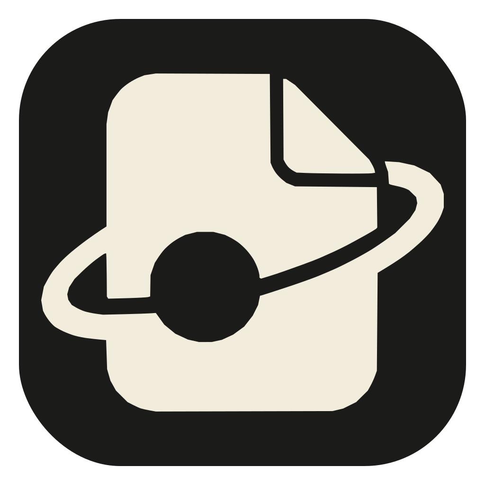

# Clonie

**나만의 맥락 저장소로 가꿉니다.**

흩어진 생각과 자료를 내 저장소에 쌓고, 필요한 순간 나와 AI가 함께 꺼내 씁니다.
Clonie는 내 Markdown 폴더를 연결해 자료를 찾고, 읽고, 고치는 macOS 앱입니다.

**[Mac용 다운로드](https://github.com/qoal1201/clonie-preview/releases/latest)** · [설치 안내](INSTALL.md) · [외부 AI 연결](plugins/clonie/README.md)

macOS 26 이상 · Apple Silicon(M 시리즈). 기본 검색·편집에는 AI 계정이나 API 키가 필요하지 않습니다.

<!-- clonie-media: screenshot -->

## Clonie로 할 수 있는 일

- **내 폴더 그대로 사용하기:** 기존 Markdown 폴더를 연결하고, PDF·Word는 원본을 보존하며 가져옵니다.
- **찾고 읽고 고치기:** 질문으로 관련 문서와 근거 문단을 찾고, 같은 화면에서 문서를 읽고 편집합니다.
- **AI와 함께 보완하기:** 쓰던 AI가 같은 자료를 참고하고 변경을 제안하면, 앱에서 검토하고 승인합니다.

## 처음 사용하기

1. **Mac용 다운로드**에서 ZIP을 받아 압축을 풉니다.
2. `Clonie.app`을 응용 프로그램 폴더로 옮겨 실행합니다.
3. 사용할 Markdown 폴더를 선택합니다. [예제 문서](sample-vault/)로 시작할 수도 있습니다.
4. 자료에 질문하고 문서를 열어 편집합니다. 저장한 내용은 다음 작업에서 다시 찾아 쓸 수 있습니다.

[Homebrew·터미널 설치](INSTALL.md#터미널에서-설치) · [업데이트](INSTALL.md#업데이트) · [문제 해결](INSTALL.md#문제-해결)

## 외부 AI와 함께 쓰기

로컬 Codex·Work locally·Codex CLI에 [Clonie 플러그인](plugins/clonie/README.md)을 설치하면
앱에서 선택한 자료를 AI에서도 활용할 수 있습니다. AI의 프로젝트 폴더가 달라도 되고, 프로젝트 없이 시작해도 됩니다.

> Clonie에서 이번 작업과 관련된 기록을 찾아 읽어줘. 참고한 문서 경로도 알려줘.

> 이 문서에 오늘 결정한 내용을 반영하는 변경 제안을 보내줘.

AI가 보낸 제안은 Clonie의 **변경** 탭에서 비교·수정·승인합니다. 승인한 내용만 Markdown에 저장되며,
AI도 다음 조회에서 저장된 내용을 읽습니다. [설치 방법과 지원 환경](plugins/clonie/README.md)을 확인하세요.

<!-- clonie-media: demo -->

## 내 자료와 개인정보

Markdown과 검색 색인·기록은 사용자가 연결한 폴더에 보관합니다. 앱을 지워도 자료 폴더는 유지됩니다.
기본 검색은 기기 안에서 처리하며, 외부 AI에 읽도록 요청한 자료는 해당 AI 서비스에서 처리됩니다.
[개인정보 안내](PRIVACY.md)와 [지원 범위](INSTALL.md#지원-범위)를 참고하세요.

## 참여하기

[사용 피드백](https://github.com/qoal1201/clonie-preview/issues/new?template=feedback.yml) · [기여 안내](CONTRIBUTING.md) · [변경 기록](CHANGELOG.md) · [보안 문제 제보](SECURITY.md)

## 라이선스

신규 자체 변경에는 [PolyForm Perimeter 1.0.1](LICENSE)을 적용합니다. 사용 제한이 있는 소스 공개 라이선스입니다.
기존 MIT 권리와 제3자 고지는 유지합니다. [적용 범위](LICENSING.md) · [제3자 고지](ThirdPartyNotices/) · [프로젝트 출처](HISTORY.md)
